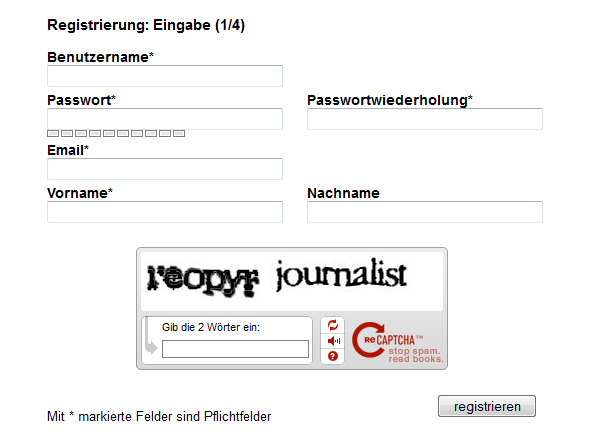

.. include:: ../Includes.txt

.. _introduction:

Introduction
============

This Documentation was written for version 2.0.0 of the extension.

What does it do?
----------------

Registration with admin review and all notifications:
~~~~~~~~~~~~~~~~~~~~~~~~~~~~~~~~~~~~~~~~~~~~~~~~~~~~~

When a new user fills in the registration form they will see the
strength of their password, along with additional email address
and password fields to ensure they are filled in correctly.

Upon submitting the form, the user will have their data presented
to them for review, just in case they want to change something.
If the user submits again, the data is then stored in the database
with a temporary usergroup. Any uploaded pictures are stored in a
temporary folder until the user is activated.

The user is then sent an email with a link to verify their email address.
The website administrator also receives an email to notify them that
a new user has registered.

Once the user has verified their email address, the admin will be sent
another notification, but this time containing an activation link.
If the admin decides to accept the new user, they can click the link
which will then update the database and set a regular usergroup for
that user's account. One final email notification is sent to the user
to inform them that their account is now active.

The new user will be able to log in and see all the pages and content
that their usergroup permits!

Features:
~~~~~~~~~~~~~~

- Simple frontend user registration

- uses extbase and fluid

- admin review optional

- email notification to users after each step

- email notification to admin after each step

- password strength indicator without javascript library

- localisation support by static info tables

- daylight saving support

- respect AGB checkbox included

- Captcha integration

- email as username supported

- required fields validator and some more validators out of the box

- edit profile

- change password

- change frontend view for every form and registration step

- english and german localisation included

- mechanism to avoid profile images as file transfer by encrypted
  filenames and storage in temporary folders

- saltedpassword encryption (if activated) or sha1- and md5 encryption
  support

- configuration by TypoScript – customize to your needs

Screenshots:
~~~~~~~~~~~~

.. figure:: Images/screenshot_createform.png
   :alt: *Illustration 2: extensive register form with sr\_freecap*
   :align: left
